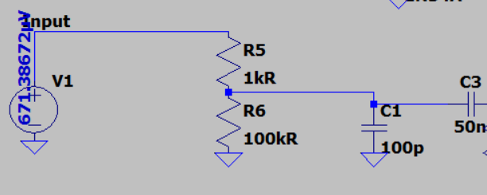
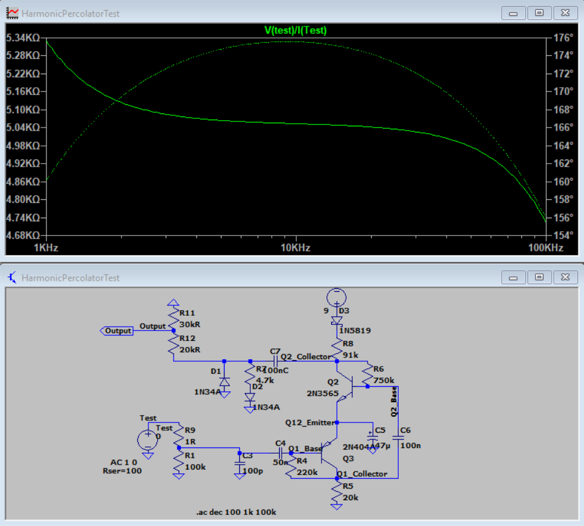
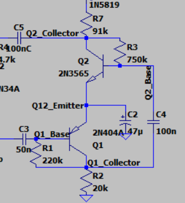
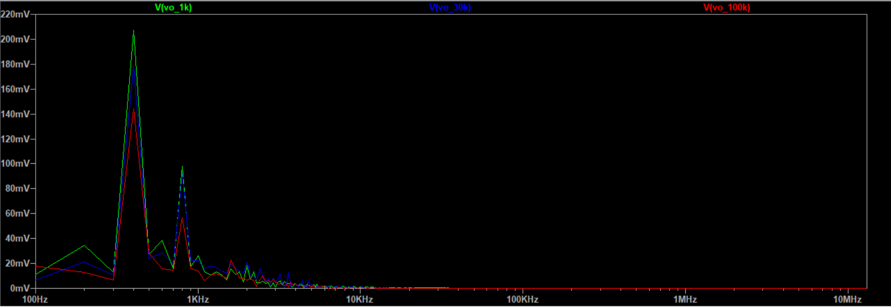

# General Development Log - Harmonic Percolator Project

## 27-10-2025
### Introduction
This is the first entry into my 'General Development Log' for the harmonic percolator pedal I am building. I aim to produce a unique harmonic percolator pedal and learn all about effect pedal theory and construction by practice.
### Undocumented Progress
This project began in summer 2024, when I decided to delve into my passion for guitar pedals and learn how they tick. I started by watching a few of 'Landertronics' youtube videos to explain amplifiers and BJTs, commonly found in effects pedals. I quickly learned without a practical example, I had no intuitive connections to real-world applications. So, I decided to build a harmonic percolator as a case study, chosen mainly because I couldn't afford a commercial one. 
Up to this point I had learned basic electronic theory from my laboratory classes in my physics degree. I also could solder adequately, having replaced a faulty switch on a recently purchased Jekyll & Hyde overdrive distortion pedal. Next, I found a harmonic percolator circuit: "https://www.madbeanpedals.com/projects/_folders/1590A/pdf/PepperSpray2019.pdf", bought the components and a breadboarding starter kit and began to build. I was satisfied with the sound of the breadboarded circuit and decided to commit to the design. I constructed the circuit on Kicad and familiarised myself with the basics of LtSpice. I followed youtube to construct a pcb and ordered five copies. As of the end of autumn 2024 I had a working prototype of my 'Many Faces' harmonic percolator.
I achieve the high end tone I want, but the sound is spluttery and quiet in the low end. I was frustrated as to why, so I decided to learn more about the theory behind effects pedals in a hope to be able to find and resolve the cause of the issue. From the autumn of 2024 to the summer of 2025 I was completing my final year of my physics degree, so I had no time to really research effects pedals. Interestingly, I did my dissertation on the design of a tuning device for a musical instrument, learning signal processing and DSP theory.
Since graduation I have been following Sedra & Smiths Microelectronic Circuits to learn about BJTs and amplifier architecture, once I reach amplifiers with collector feedback I will have learned all parts of the harmonic percolator circuit. From which, I can experiment with parameters such as transistor biases and coupling/decoupling capacitor values. My progress up until this point is saved in the repository under MF-v1.

## 15-02-2026
### Progress Update
Over the past few months I have become comfortable with BJT biasing, small-signal analysis, single-stage amplifiers and shunt-shunt feedback - all topics I have learned by following the examples and problems in Sedra & Smith. Paired with an LTSpice schematic of my V1 Many Faces harmonic percolator, I learned visually what happens to a sine waveform when incident on the common emitter amplifiers in the harmonic percolator topology, and when each transistor is driven into saturation or cutoff. My notes on this can be found in the Notion file: https://www.notion.so/Electronics-Notes-26a27d91a6fe80558542cc7c8c5bb23a?source=copy_link. 

### Next Steps
The next stage of pedal design will be an experimental phase. I have acquired a DI signal of clean guitar in a .wav file from my audio engineer friend, and will send this through my LTSpice harmonic percolator circuit as the voltage input. The output voltage will be recorded as a second .wav file, from which I can audibly inspect the effect of the circuit on a typical guitar signal. Futher, a transient analysis of the waveforms will be recorded in LTSPice which enables possible Fourier analyses. The experiments I'd like to focus on are effect of an input buffer (pickup simulator), filters before/after each transistor stage (inclduing effect of changing feedback resistor) and different types of clipping circuits.

## 25-02-2026 - 07-03-2026
### Experiment 1 - Input Stage

The first tweak I am aiming to make to the HP circuit is to allow greater versitility in terms of pedal chain order. I will test different configurations of input impedance for the harmonic percolator to find the optimal one, that allows versatile pedal placement without comprimising a solid tone. The measurement of the HP-v1's input impedance can be seen in Figure 2, which is dominated by the bias resistor (harmonics pot). The input impedance varies between 5k-100k Ohms between the slider ends of the potientiometer. 

When we place the percolator directly after the guitar, the pedal sees a relatively high output impedance compared to placing the percolator after another modern pedal.
Modern pedals typically have an output impedance of 100 Ohms whereas guitar pickups are around 5k Ohms for single coils and 15k Ohms for humbuckers. Since this pedal was designed as a 'vintage fuzz' type, the input stage was designed to interact with a output impedance. Low output impedances introduce signals that are too large to the gain stage, causing wildly unusable distortion and gain. The output impedance of the preceding device in the chain determines the amount the percolator circuit loads. Putting a 5k Ohm resistor in series to the harmonics pot will simulate pickup impedance. It's a good idea to have the option to toggle this resistor in for both pedal chain placement incidences.

The original design ends the input stage with a low-pass filter (C1) and coupling capacitor C2. The orignal value of C1 is 100nF. 

## 08-03-2026 
### Experiment 2 - Gain Stage
This part of the pedal should create a very percussive, abrasive sound - useful for creating industrial 'clanging' noise when picking muted. An idea to base this off is the Aleph Null Peacock Parallel Fuzz, which runs a modified percolator as one of its parallel channels. There is a MOSFET instead of the BJT for Q2 (which seems to be implimented due to issues with buffer pedals - which I have addressed, so I will continue with the 2n3565 for Q2). Alot of modifications to the Interfax/Pepper Spray HP on the Peacock seem to be passive tone shaping, which is the area I will investigate first in order to reproduce this 'clangy' tone. 

#### a. Pre-Q1 Filtering
First, we can select the allowed frequency ranges to interact with the gain stage with a combination of a high-pass (coupling capacitor) and low-pass (parallel capacitor to ground) filter. V1's low-pass consists of a 100pF parallel capacitor -  for approximate $10^{3} \Omega$, this leaves $f_{cutoff}\approx 15k$ Hz. This would remove alot of hissing or the 'brilliance' quality of the effect. I am swayed to keep this but I think it's wise to revisit this after the rest of the pedal is developed.

## 09-03-2026
V1's high-pass contains a series 50nF capacitor, which cuts off low frequncies below $\approx 100$ Hz. For our purpose, this should be decreased to increase the cut off frequency. The Peacock suggests 10nF, so I tested the sound of the circuit with C3 taking values of stock 50nF, 25nF, 10nF, and 1nF. 50nF and 25nF seemed to keep the low-end muddiness that I'm trying to remove, and 1nF removed far too much frequency content to make the effect usable. So 10nF seems the sweet spot. The audio files are found at the address: "C:\Users\charl\OneDrive\Documents\Electronics\Effects Pedals\Harmonic Percolator\V2 Development\harmonic-percolator-devlog\AV_Files\C3".

#### b. Q1 Collector Biasing
R2 effects the biasing of the whole complemtary totem-pole transistor pair. Changing one of the bias resistors (in this case R2) results in different bias points for all of Q2 and Q1's terminals. In fact, decreasing R2 increases the junction voltages for both Q1 and Q2. Measurement can be found at the address: "C:\Users\charl\OneDrive\Documents\Electronics\Effects Pedals\Harmonic Percolator\V2 Development\harmonic-percolator-devlog\AV_Files\R2\HP-V2 Development R2 Bias.xlsx"
A greater junction voltage means a greater headroom for amplified signals before entering cutoff or saturation BJT modes of operation, this means less distortion. By distorting a singal, you amplify non-linearly, producing new frequency content by shaping the time series waveform.  The quantitative effect on the frequency content of varying R2 can be seen in Figure 5.

Audibly, 100k Ohms reduces the amount of fuzz to an almost overdrive likeness, 1k sounds buzzy - fuzzy in the higher frequencies, 30k moves that buzziness to a more mid-range. Quantitatively, we can see that there is much more freuncy content for 30k Ohms in the upper-mid range (1.5-4kHz) - this gives a picked note its 'clang'.

#### c. Q1 Feedback and Pre-Q2 Filtering
Both Q1 and Q2 feature shunt-shunt feedback, which results in an inverse dependancy of both input and output impedance on the 'amount of feedback': $R_{of}=\frac{R_o}{1+A\beta}, R_{if}=\frac{R_i}{1+A\beta}$ This can allow us to create a tweakable filtering topology when combined with a parallel or series capacitor. 

## 11-03-2026
First, to show some comprehension of the reading I've been doing, I'm going to compute the expected effects on input and output impedance of Q1 by varying R4 (the feedback resistor).

## 12-03-2026
Start writeup of the simulation vs measured output impedances of Q1. This may be due to incorrect measurement of output impedance during the simulation. This could have been an error carried over from the input impedance method. Notably, the DC biases on Q1 are different when I use a 'test' voltage to measure output impedance to Q1. Find correct method, then check for input impedance of Q1 as per 25-02-2026.

My thoughts for finding a way to measure, understand, and then tweak the frequency response of Q1 was to measure the output impedance of Q1. Feedback theory tells me that output impedance increases with the feedback resistor; and that in conjucntion with parallel and series capacitors you can filter the frequencies present in the distorted signal of Q1. Then I'd be able to estimate the frequency band allowed by this filter by calculating high and low cutoff frequencies.

I began by isolating Q1, conducting a circuit theory exercise to calculate the output impedance of the circuit as a function of the feedback resistance. This involved modelling Q1 for small signals, and splitting the circuit into A and B subcircuits as per the method to find output and input impedances (see orange notebook for method). This gave the equation for output resistance $$R_{of}= \frac{R_o}{1+\frac{-g_m (R_f\parallel R_C)(R_S \parallel R_f \parallel r_\pi)}{R_f}}$$
Simulated in a python script for varying $R_f$ (which can be found in the R4 AV files), gave the resultant plot as seen in Figure 6.

Copy the experiment of LTspice onto here showing expected results via measurement via test signal

Go onto say that this method would prbably be a good idea if Q1 was the only output stage - things get much more complex when we consider the interconnected Q2. Rather, we could directly measure the frequency response of signals at the collector of Q1 - given we use filtering topologies in the feedback loop of Q1.

## 23-03-2026
The important thing to note is that due to the complex system of Q1 and Q2 coupled together, a simple model quantifying the filtering of the opertation of Q1 is not easy to derive. Hence, using LTSpice will be a helpful tool. Nevertheless, understanding the following topics are crucial to be able to qualitatively design the filter effects of Q1: finding amplifier parameters (most importantly voltage gain $A_v$) of a collector-base feedback common-emitter amplifier, Bode plots inclduing zeros and poles of transfer functions, and low-pass active filter topologies.

